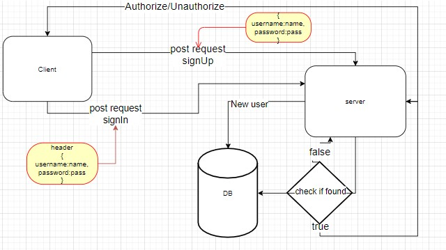

# basic-auth
Author:wijdan khaled

 build of an authentication system,

 POST to /signup to create a new user
POST to /signin to login as a user (use basic auth)
Need tests for auth middleware and the routes
Does the middleware function (send it a basic header)
Do the routes assert the requirements (signup/signin

**Tests**
- Unit Tests: npm run test
- Lint Tests: npm run lint

.env requirements
PORT - 3000

